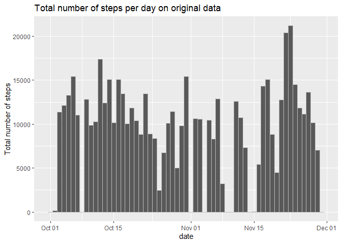
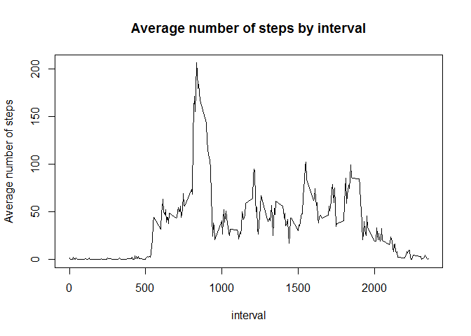
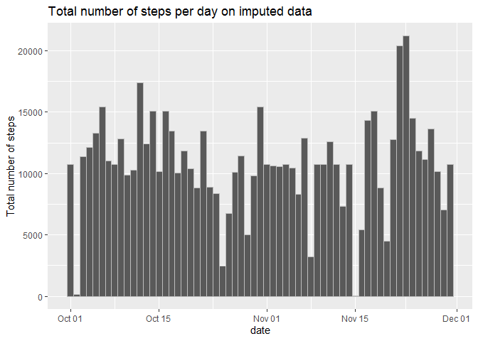
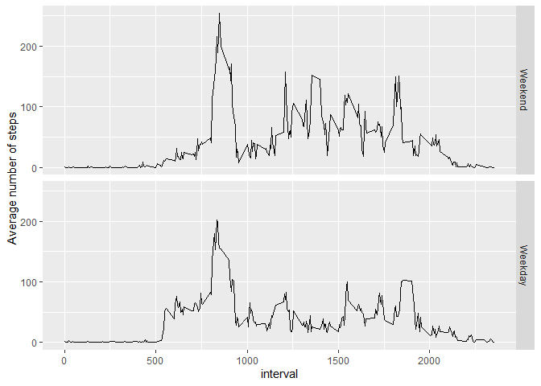

## Loading and preprocessing the data
Loading used packages and switch locale to English:

```r
library(readr)
library(dplyr)
```

```
## 
## Attaching package: 'dplyr'
```

```
## The following objects are masked from 'package:stats':
## 
##     filter, lag
```

```
## The following objects are masked from 'package:base':
## 
##     intersect, setdiff, setequal, union
```

```r
library(ggplot2)
library(lubridate)
```

```
## 
## Attaching package: 'lubridate'
```

```
## The following objects are masked from 'package:base':
## 
##     date, intersect, setdiff, union
```

```r
Sys.setlocale(locale = "English")
```

```
## [1] "LC_COLLATE=English_United States.1252;LC_CTYPE=English_United States.1252;LC_MONETARY=English_United States.1252;LC_NUMERIC=C;LC_TIME=English_United States.1252"
```

Load data with automatic unzip using `read_csv` from `readr` package.

```r
raw_data <- read_csv("activity.zip")
```

```
## Parsed with column specification:
## cols(
##   steps = col_double(),
##   date = col_date(format = ""),
##   interval = col_double()
## )
```


## What is mean total number of steps taken per day?
Total number of steps per day:

```r
totalSteps <- raw_data %>% filter(!is.na(steps)) %>% group_by(date) %>% summarize(total = sum(steps), .groups = "keep")
totalSteps %>% print(n = nrow(.))
```

```
## # A tibble: 53 x 2
## # Groups:   date [53]
##    date       total
##    <date>     <dbl>
##  1 2012-10-02   126
##  2 2012-10-03 11352
##  3 2012-10-04 12116
##  4 2012-10-05 13294
##  5 2012-10-06 15420
##  6 2012-10-07 11015
##  7 2012-10-09 12811
##  8 2012-10-10  9900
##  9 2012-10-11 10304
## 10 2012-10-12 17382
## 11 2012-10-13 12426
## 12 2012-10-14 15098
## 13 2012-10-15 10139
## 14 2012-10-16 15084
## 15 2012-10-17 13452
## 16 2012-10-18 10056
## 17 2012-10-19 11829
## 18 2012-10-20 10395
## 19 2012-10-21  8821
## 20 2012-10-22 13460
## 21 2012-10-23  8918
## 22 2012-10-24  8355
## 23 2012-10-25  2492
## 24 2012-10-26  6778
## 25 2012-10-27 10119
## 26 2012-10-28 11458
## 27 2012-10-29  5018
## 28 2012-10-30  9819
## 29 2012-10-31 15414
## 30 2012-11-02 10600
## 31 2012-11-03 10571
## 32 2012-11-05 10439
## 33 2012-11-06  8334
## 34 2012-11-07 12883
## 35 2012-11-08  3219
## 36 2012-11-11 12608
## 37 2012-11-12 10765
## 38 2012-11-13  7336
## 39 2012-11-15    41
## 40 2012-11-16  5441
## 41 2012-11-17 14339
## 42 2012-11-18 15110
## 43 2012-11-19  8841
## 44 2012-11-20  4472
## 45 2012-11-21 12787
## 46 2012-11-22 20427
## 47 2012-11-23 21194
## 48 2012-11-24 14478
## 49 2012-11-25 11834
## 50 2012-11-26 11162
## 51 2012-11-27 13646
## 52 2012-11-28 10183
## 53 2012-11-29  7047
```

Histogram of the total number of steps per day:

```r
ggplot(raw_data, aes(date)) + geom_histogram(aes(weight = steps), na.rm = TRUE, binwidth = 1, color = "grey") + ylab("Total number of steps") + ggtitle("Total number of steps per day on original data")
```

<!-- -->

Mean and median of the total number of steps:

```r
mean(totalSteps$total)
```

```
## [1] 10766.19
```

```r
median(totalSteps$total)
```

```
## [1] 10765
```


## What is the average daily activity pattern?
Average number of steps per interval:

```r
meanStepsInterval <- raw_data %>% group_by(interval) %>% summarize(Mean.Steps = mean(steps, na.rm = TRUE), .groups = "keep")
plot(meanStepsInterval, type = "l", ylab = "Average number of steps", main = "Average number of steps by interval")
```

<!-- -->

Interval with highest average number of steps:

```r
maxmean <- meanStepsInterval[which.max(meanStepsInterval$Mean.Steps),]
maxmean
```

```
## # A tibble: 1 x 2
## # Groups:   interval [1]
##   interval Mean.Steps
##      <dbl>      <dbl>
## 1      835       206.
```


## Imputing missing values
Total number of missing values: 

```r
sum(is.na(raw_data))
```

```
## [1] 2304
```

Impute missing values with average of interval:

```r
imputed <- raw_data
onlyMissing <- raw_data %>% filter(is.na(steps))

imputed[is.na(imputed$steps),] <- onlyMissing %>%
    inner_join(meanStepsInterval %>% filter(interval %in% onlyMissing[[3]]), by = "interval", copy = FALSE) %>% 
    select(steps = Mean.Steps, date = date, interval = interval)
```

Total number of steps per day with imputed data:

```r
totalStepsImputed <- imputed %>% group_by(date) %>% summarize(total = sum(steps), .groups = "keep")
totalStepsImputed %>% print(n = nrow(.))
```

```
## # A tibble: 61 x 2
## # Groups:   date [61]
##    date        total
##    <date>      <dbl>
##  1 2012-10-01 10766.
##  2 2012-10-02   126 
##  3 2012-10-03 11352 
##  4 2012-10-04 12116 
##  5 2012-10-05 13294 
##  6 2012-10-06 15420 
##  7 2012-10-07 11015 
##  8 2012-10-08 10766.
##  9 2012-10-09 12811 
## 10 2012-10-10  9900 
## 11 2012-10-11 10304 
## 12 2012-10-12 17382 
## 13 2012-10-13 12426 
## 14 2012-10-14 15098 
## 15 2012-10-15 10139 
## 16 2012-10-16 15084 
## 17 2012-10-17 13452 
## 18 2012-10-18 10056 
## 19 2012-10-19 11829 
## 20 2012-10-20 10395 
## 21 2012-10-21  8821 
## 22 2012-10-22 13460 
## 23 2012-10-23  8918 
## 24 2012-10-24  8355 
## 25 2012-10-25  2492 
## 26 2012-10-26  6778 
## 27 2012-10-27 10119 
## 28 2012-10-28 11458 
## 29 2012-10-29  5018 
## 30 2012-10-30  9819 
## 31 2012-10-31 15414 
## 32 2012-11-01 10766.
## 33 2012-11-02 10600 
## 34 2012-11-03 10571 
## 35 2012-11-04 10766.
## 36 2012-11-05 10439 
## 37 2012-11-06  8334 
## 38 2012-11-07 12883 
## 39 2012-11-08  3219 
## 40 2012-11-09 10766.
## 41 2012-11-10 10766.
## 42 2012-11-11 12608 
## 43 2012-11-12 10765 
## 44 2012-11-13  7336 
## 45 2012-11-14 10766.
## 46 2012-11-15    41 
## 47 2012-11-16  5441 
## 48 2012-11-17 14339 
## 49 2012-11-18 15110 
## 50 2012-11-19  8841 
## 51 2012-11-20  4472 
## 52 2012-11-21 12787 
## 53 2012-11-22 20427 
## 54 2012-11-23 21194 
## 55 2012-11-24 14478 
## 56 2012-11-25 11834 
## 57 2012-11-26 11162 
## 58 2012-11-27 13646 
## 59 2012-11-28 10183 
## 60 2012-11-29  7047 
## 61 2012-11-30 10766.
```

Histogram of the total number of steps per day:

```r
ggplot(imputed, aes(date)) + geom_histogram(aes(weight = steps), binwidth = 1, color = "grey") + ylab("Total number of steps") + ggtitle("Total number of steps per day on imputed data")
```

<!-- -->

Mean and median of number of steps taken each day:

```r
mean(totalStepsImputed$total)
```

```
## [1] 10766.19
```

```r
median(totalStepsImputed$total)
```

```
## [1] 10766.19
```
The only missing data was steps from 8 entire days. After imputing with my strategy (interval average) their values are the same and average of those values is equal to the mean of the total number of steps with missing values removed. Because of that mean didn't change.
Median changed to higher value, because imputing added data that was higher than median. It seems that imputing in this case balances data set since mean and median are equal.


## Are there differences in activity patterns between weekdays and weekends?
Introduce new column indicating whether a date is a weekday or weekend day

```r
withDayType <- imputed %>% 
  mutate(DayType = factor(wday(imputed$date) < 6, labels = c("Weekend", "Weekday")))
```

Calculate mean of number of steps per interval split by day type:

```r
grouped <- withDayType %>% group_by(interval, DayType) %>% summarize(Mean.Steps = mean(steps), .groups = "keep")
ggplot(grouped, aes(x = interval, y = Mean.Steps)) + geom_line() + facet_grid(DayType ~.) + ylab("Average number of steps")
```

<!-- -->
